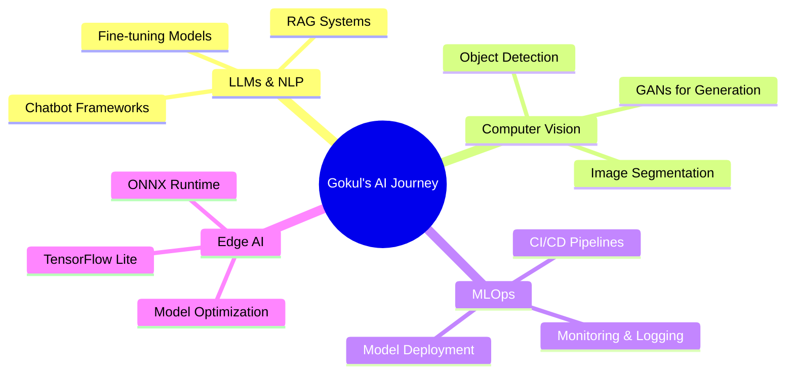

<div align="center">

<!-- Animated Header -->


<!-- Typing Animation -->
<a href="https://git.io/typing-svg"></a>

<!-- Badges -->
<p>
  
  
  
</p>

<!-- Animated Separator -->


</div>

## 🚀 About Me

```python
class Ramyasri:
    def __init__(self):
        self.name = "Gokul V S"
        self.role = "Machine Learning Engineer"
        self.location = "Tiruppur, Tamil Nadu, India"
        self.passion = "Building AI that transforms ideas into reality"
        
    def get_skills(self):
        return {
            "languages": ["Python", "SQL", "JavaScript"],
            "ml_frameworks": ["TensorFlow", "PyTorch", "Scikit-Learn"],
            "dl_specialties": ["Neural Networks", "NLP", "Computer Vision", "GANs"],
            "tools": ["Docker", "Git", "Jupyter", "VS Code"],
            "deployment": ["Flask", "FastAPI", "Streamlit", "Dash"],
            "databases": ["PostgreSQL", "MongoDB", "Redis"],
            "cloud": ["AWS", "Azure", "Google Cloud"]
        }
    
    def current_focus(self):
        return [
            "🔬 Exploring Large Language Models (LLMs)",
            "🛠️ Building MLOps pipelines",
            "⚡ Optimizing models for Edge AI",
            "🌐 Contributing to open-source AI projects"
        ]

me = Ramyasri()
print(f"👋 Hi! I'm {me.name}, passionate about {me.passion}")
```

<div align="center">

</div>

## 🛠️ Tech Arsenal

<div align="center">

### 💻 Languages & Frameworks
<p>
  
</p>

### 🌐 Development & Deployment
<p>
  
</p>

### 📊 Data & Visualization
<p>
  
  
  
  
  
</p>

### ☁️ Cloud & Databases
<p>
  
  
  
  
</p>

</div>

<div align="center">

</div>

## 📊 GitHub Analytics

<div align="center">
  
  
</div>

<div align="center">
  
</div>

<!-- Activity Graph -->
<div align="center">
  
</div>

<div align="center">

</div>

## 🏆 GitHub Trophies

<div align="center">
  
</div>

<div align="center">

</div>

## 🔥 Featured Projects

<div align="center">

<a href="https://github.com/Ramyasri/ai-dashboard">
  
</a>

<a href="https://github.com/Ramyasri/neural-network-scratch">
  
</a>

<a href="https://github.com/Ramyasri/image-classifier">
  
</a>

<a href="https://github.com/Ramyasri/chatbot-ai">
  
</a>

</div>

<div align="center">

</div>

## 📈 Contribution Snake

<div align="center">
  <picture>
    <source media="(prefers-color-scheme: dark)" srcset="https://raw.githubusercontent.com/Ramyasri/Ramyasri/output/github-contribution-grid-snake-dark.svg">
    <source media="(prefers-color-scheme: light)" srcset="https://raw.githubusercontent.com/Ramyasri/Ramyasri/output/github-contribution-grid-snake.svg">
    
  </picture>
</div>

<div align="center">

</div>

## 💡 What I'm Currently Building



<div align="center">

</div>

## 🌐 Connect With Me

<div align="center">

[](https://linkedin.com/in/your-profile)
[](https://kaggle.com/yourusername)
[](https://github.com/Ramyasri)
[](mailto:youremail@gmail.com)
[](https://yourportfolio.com)
[](https://twitter.com/yourusername)

</div>

<div align="center">

</div>

## ⚡ Fun Facts

<div align="center">

```yaml
personality:
  - 🎮 Gamer when not coding
  - ☕ Coffee-powered debugging expert
  - 🎬 Sci-fi movie enthusiast
  - 🌍 Dream: AI that solves real-world problems
  - 🎯 Mission: Make AI accessible to everyone
  - 💭 Philosophy: "Code is poetry, AI is the future"
```

</div>

<div align="center">

</div>

## 📚 Latest Blog Posts

<!-- BLOG-POST-LIST:START -->
- 🧠 [Understanding Neural Networks from Scratch](https://yourblog.com)
- 🚀 [MLOps Best Practices in 2025](https://yourblog.com)
- 🔥 [Building Production-Ready AI Systems](https://yourblog.com)
- 💡 [The Future of Edge AI](https://yourblog.com)
<!-- BLOG-POST-LIST:END -->

<div align="center">

</div>

<div align="center">

### 💭 Quote of the Day


### ✨ Random Dev Meme


</div>

<div align="center">

</div>

<div align="center">

## 🎯 "AI is not just the future — it's the present we're building today."

### Show some ❤️ by starring my repositories!


</div>
